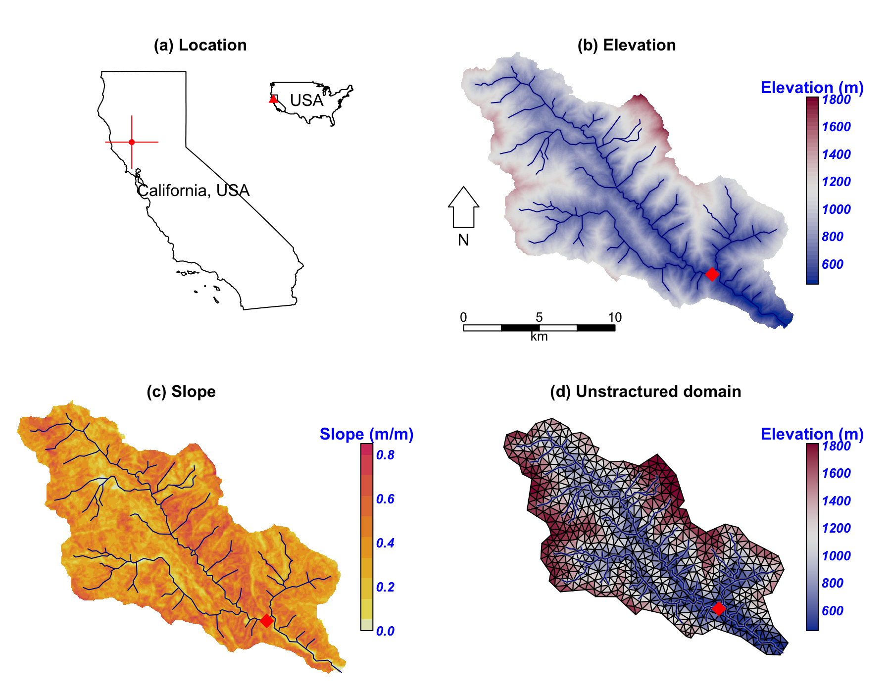
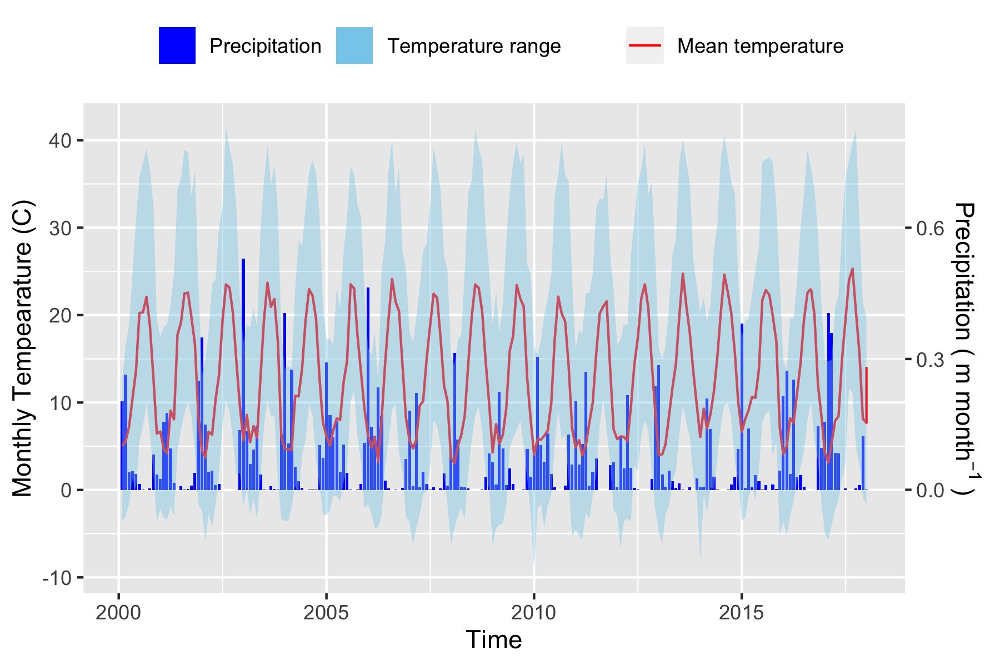
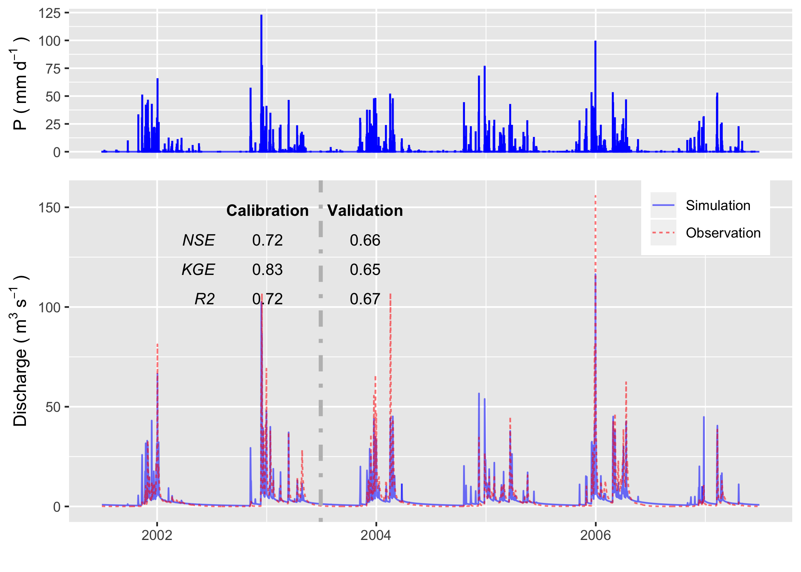
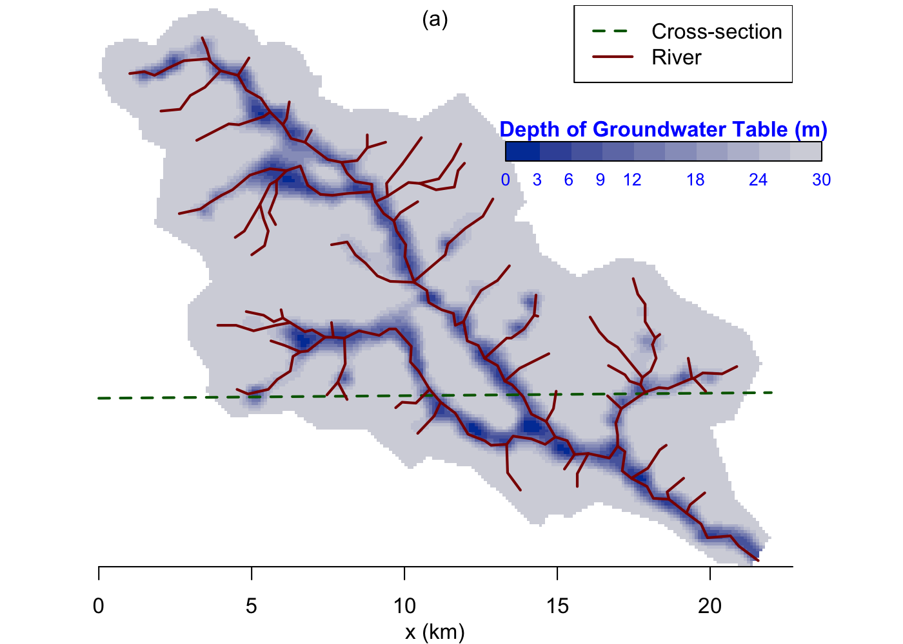
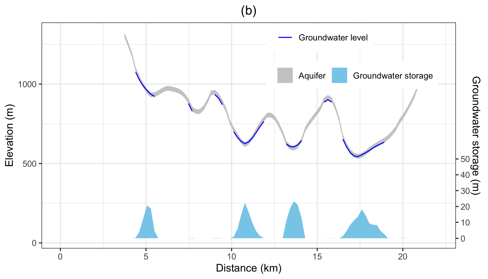
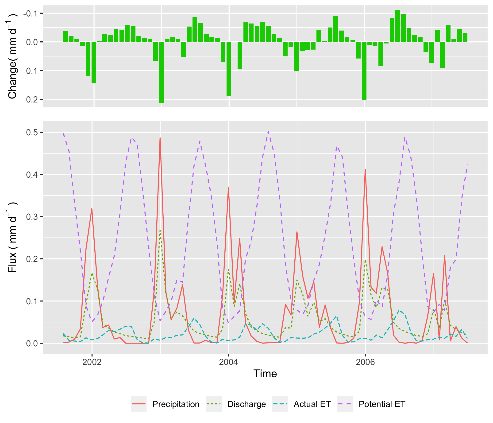

# Cache Creek Watershed (CCW) hydrological modeling with SHUD model.

**SHUD - Solver of Hydrological Unstructured Domain.**

Website: [www.shud.xyz](www.shud.xyz)

Author: Lele Shu [www.shulele.net](www.shulele.net)

## Cache Creek Watershed

The Cache Creek Watershed (CCW) is a headwater catchment with area $196.4 km^2$  in the Sacramento Watershed in Northern California (Figures \ref{fig:sh} (a), (b) and (c)). The elevation ranges from $450 m$ to $1800 m$, with a $0.38 m/m$ average slope which is very steep, and hence a particularly difficult watershed for hydrologic models to simulate.

According to NLDAS-2, between 2000 and 2017 the mean temperature and precipitation was $12.8 ^\circ C$ and $\approx 817 mm​$, respectively, in this catchment. Precipitation is unevenly distributed through the year, with winter and spring precipitation being the vast majority of the contribution to the annual total (Fig. \ref{fig:sh_pt}.

## SHUD simulation and calibration

Our simulation in CCW covers the period from 2000 to 2007. Because of the Mediterranean climate in this region, the simulation starts in summer to ensure adequate time before the October start to the water year. In our experiment, the first year (2000-06-01 to 2001-06-30) is the spin-up period, the following two years (2001-07-01 to 2003-06-30 ) are the calibration period, and the period from 2003-07-01 to 2007-07-01 is for validation.

The unstructured domain of the CCW (Fig. \ref{fig:sh} (d)) is built with SHUDtoolbox, a R package on GitHub ([SHUDtoolbox]( https://github.com/shud-system/SHUDtoolbox)). The number of triangular elements is 1147, with a mean area of $ 0.17 km^2​$. The total length of the river network is $126.5 km​$ and consists of 103 river reaches and in which the highest order of stream is 4. With a calibrated parameter set, the SHUD model tooks 5 hours to simulate 17 years in the CCW, with a non-parallel configuration (OpenMP is disabled on *Mac Pro 2013 Xeon 2.7GHz, 32GB RAM*).

## Results

Figure \ref{fig:sh_calib} reveals the comparison of simulated discharge against the observed discharge at the gage station of [USGS 11451100](https://waterdata.usgs.gov/ca/nwis/uv/?site_no=11451100).
The calibration procedure exploits the Covariance Matrix Adaptation -- Evolution Strategy (CMA-ES) to calibrate automatically \citep{Hansen2016}. The calibration program assigns 72 children in each generation and keeps the best child as the seed for next-generation, with limited perturbations. The perturbation for the next generation is generated from the covariance matrix of the previous generation. After 23 generations, the calibration tool identifies a locally optimal parameter set.

We use the groundwater distribution (Fig. \ref{fig:sh_gw}) to demonstrate the spatial distribution of hydroligcal metrics calculated from the SHUD model.

Figure \ref{fig:sh_gw} illustrates the annual mean groundwater table in the validation period. Because the model fixes a $30 m$ aquifer, the results represent the groundwater within this aquifer only.
 The groundwater table and elevation along the green line on the upper map are extracted and plotted in the bottom figure. The gray ribbon is the $30 m$ aquifer, and the blue line is the location where groundwater storage is larger than zero. The green polygons with the right axis are the groundwater storage along the cross-section.  The groundwater follows the terrain, with groundwater accumulated in the valley, or along relatively flat plains. In the CCW, the groundwater is very deep or does not stay on the steep slope.

